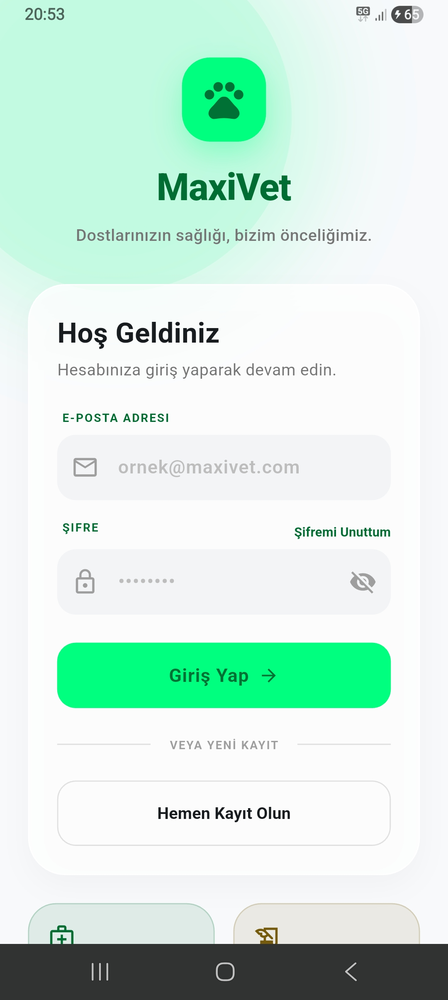
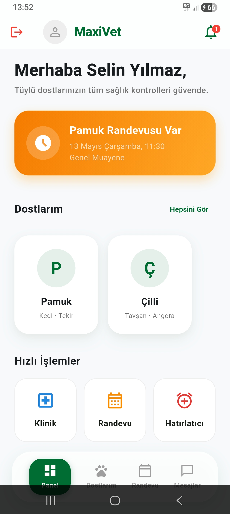
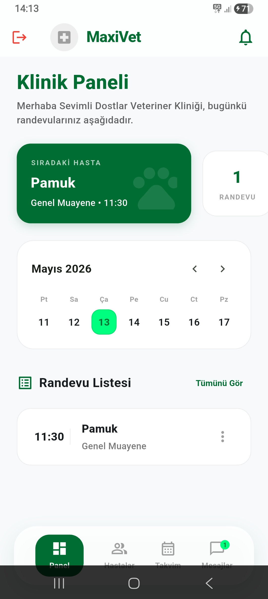
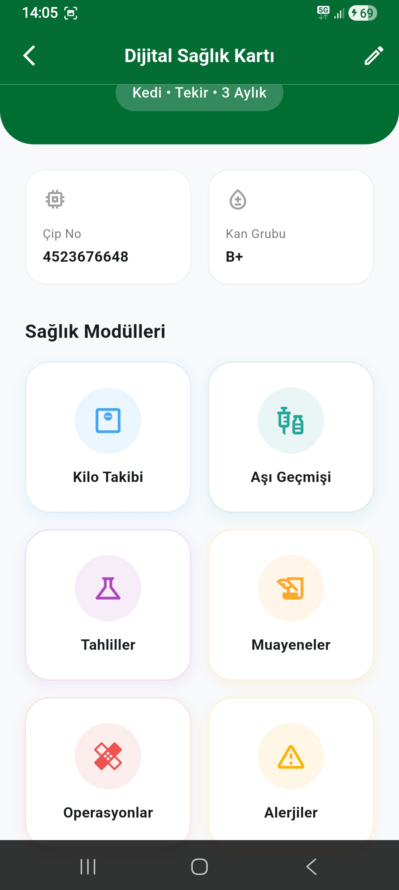
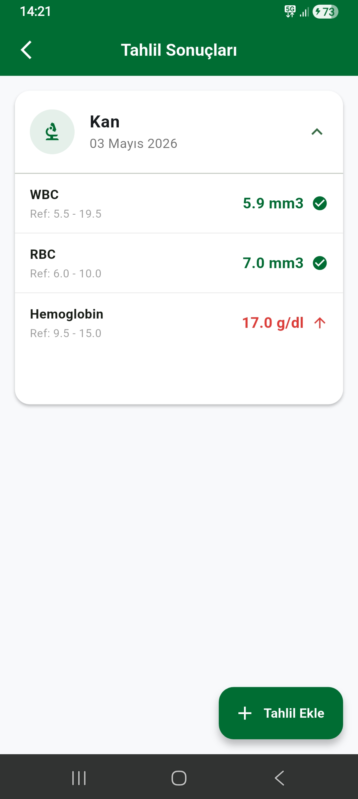
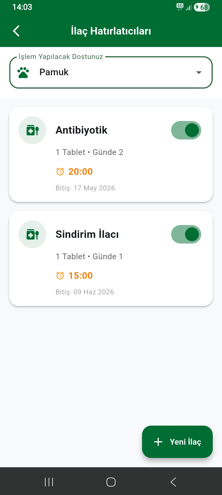
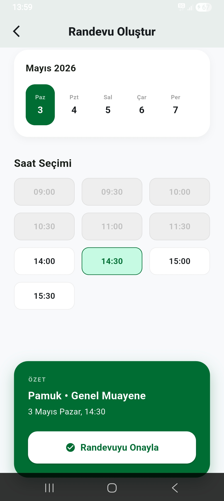
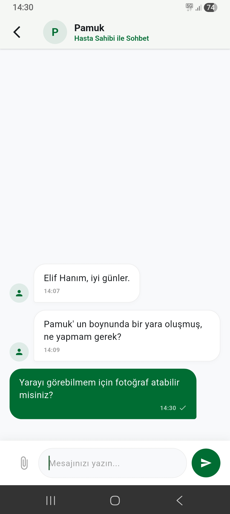

# MaxiVet

MaxiVet is a comprehensive mobile application developed to digitalize and centralize the processes between veterinary clinics and pet owners. It integrates appointment management, medical history tracking, laboratory results, and daily treatment routines into a single, seamless platform.

## About the Project

Currently, the communication and data tracking between veterinary clinics and pet owners are highly fragmented, relying on physical health books, phone calls, and scattered notes. This structure often leads to forgotten medication doses, missed vaccination schedules, and time loss in appointment management. 

MaxiVet solves this business problem by offering a two-sided architecture:
* **For Pet Owners:** Provides comprehensive pet profiles, a digital health book, laboratory result viewing, user-controlled medication alarms, and instant messaging with veterinarians.
* **For Veterinary Clinics:** Offers a centralized dashboard to manage daily workloads, schedule appointments, update patient medical archives, and communicate effectively with clients.

## Key Features

### Role-Based Access Control
* Secure authentication with strict data isolation. Pet owners can only access their pets' data, while clinics manage their registered patients.

### Digital Health Book (Anamnesis)
* Chronological tracking of examinations, surgeries, allergies, and diagnoses.
* Weight tracking with precise decimal calculations for growth monitoring.
* Digital vaccination history with automated due date calculations.

### Integrated Appointment & Calendar Management
* **Clinic Dashboard:** Interactive calendar displaying daily workloads, upcoming appointments, and available hours.
* **Pet Owners:** Ability to view clinic availability, select preferred services/veterinarians, and submit appointment requests.

### Smart Notifications & Reminders
* Automated system push notifications for upcoming vaccinations and check-ups.
* User-controlled hourly alarms for prescribed medications to ensure treatment continuity at home.

### Medical Data & Laboratory Results
* Authorized clinic staff can upload laboratory results (Biochemistry, hemogram, etc.).
* Pet owners can view detailed lab values compared against standard reference ranges, with out-of-range values clearly highlighted.

### Real-Time Communication
* Integrated text-based messaging module for direct and securely archived communication between the clinic and the pet owner.

## Screenshots

<p align="center">
  
  
  
</p>
<p align="center">
  
  
  
</p>
<p align="center">
  
  
</p>

## Tech Stack

* **Frontend:** Flutter (Cross-platform mobile framework)
* **Backend & Database:** Firebase (Authentication, Cloud Firestore)
* **Language:** Dart

## Installation & Setup

1. Clone the repository:
   ```bash
   git clone [https://github.com/YOUR_USERNAME/maxivet.git](https://github.com/YOUR_USERNAME/maxivet.git)
2. Navigate to the project directory:
   ```bash
   cd maxivet
3. Install dependencies:
   ```bash
   flutter pub get
4.Firebase Configuration:
    This project uses Firebase. You must provide your own google-services.json (for Android) and firebase_options.dart files to connect the app to your Firebase instance.
    Place the google-services.json file in the android/app/ directory.
    Generate or place the firebase_options.dart file in the lib/ directory.
5. Run the application:
   ```bash
   flutter run
## Project Team
* [Kanican Köseoğlu](https://github.com/KaniCanKOSEOGLU)
* [Enes Türkmenoğlu](https://github.com/enestrkmngll)
* [İbrahim Çobanköse](https://github.com/IbrahimCobankose)
